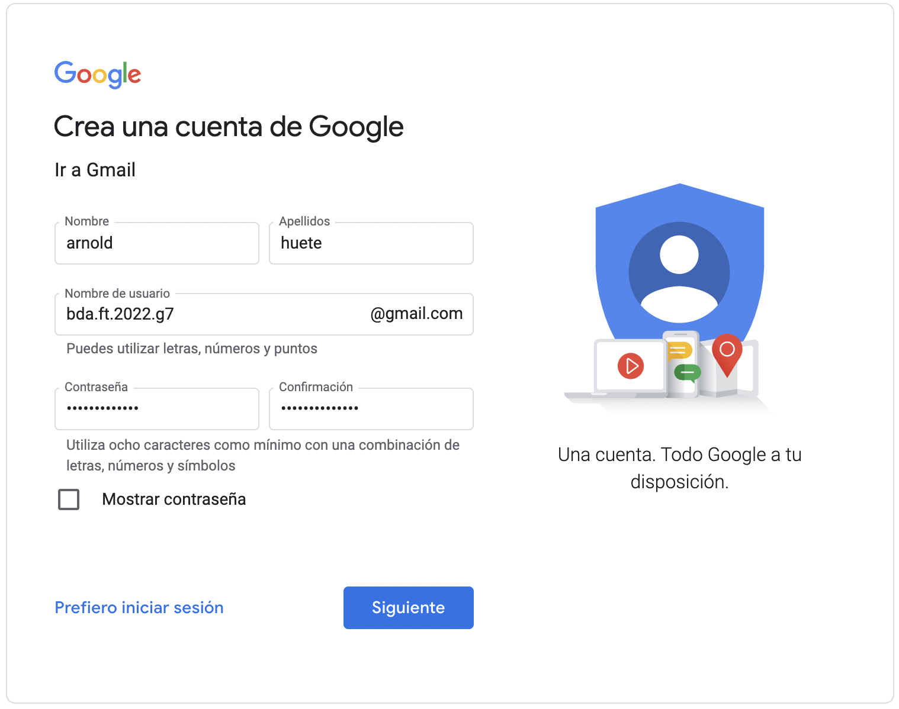
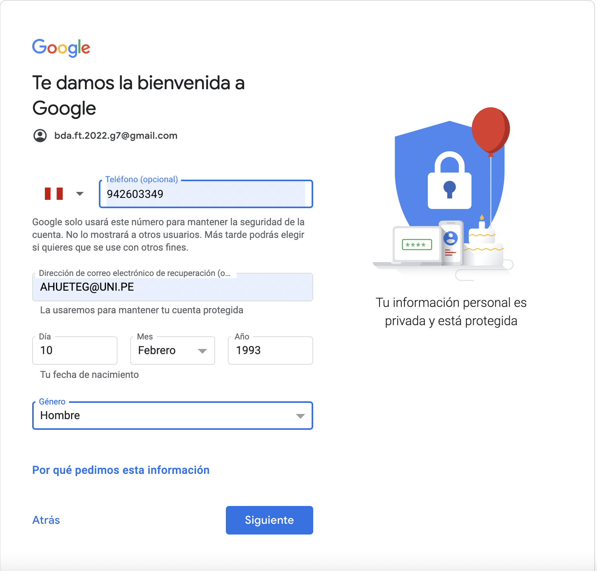
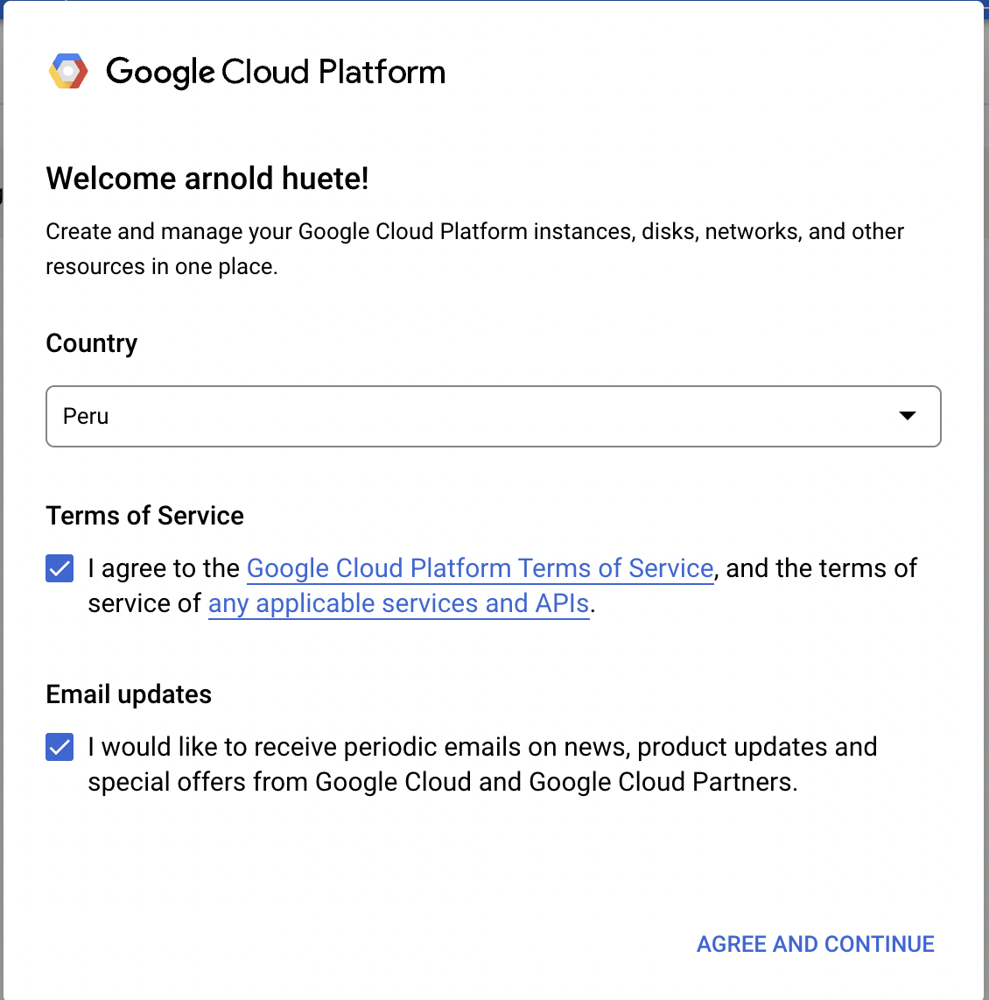
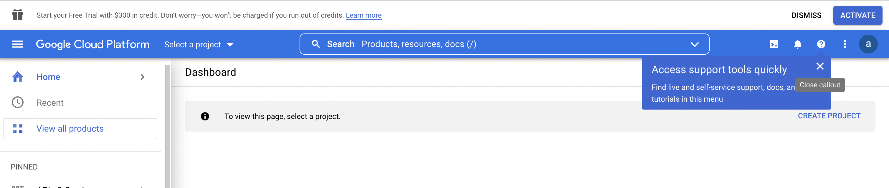
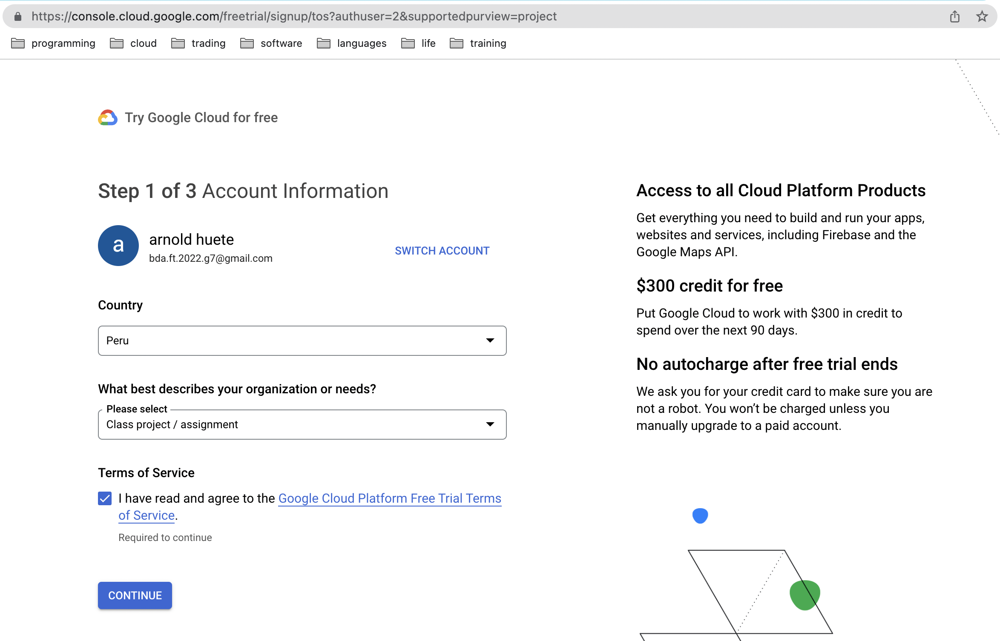
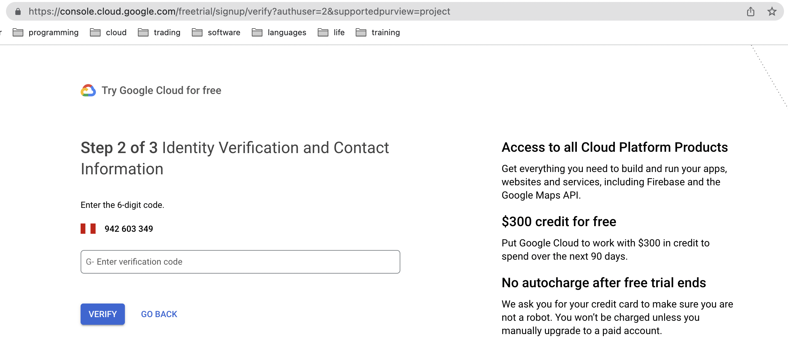
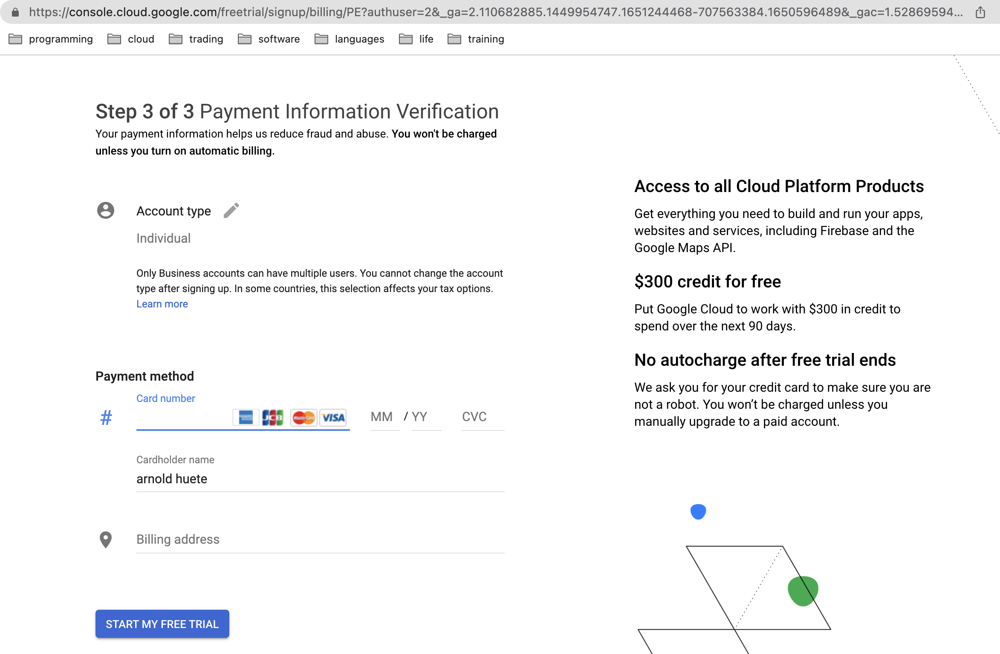

# Creación de Cuenta GCP.

Para participar en los laboratorios del curso, se requiere una cuenta de Google. Por seguridad y practicidad, sugerimos lo siguiente:

Crear una Nueva Cuenta: Establezca una cuenta de Google(gmail) separada para este curso. Esto asegura acceso sin restricciones a las herramientas necesarias y protege su información personal y laboral.

Evitar Cuentas Personales/Laborales: No se recomienda usar cuentas personales o laborales debido a posibles conflictos de permisos y riesgos de seguridad.

Esta cuenta independiente será su portal para todas las actividades de laboratorio. ¡Gracias por ayudarnos a mantener un entorno de aprendizaje seguro y efectivo!

# 1. Paso a paso para crear cuenta gmail.

1. Acceder al siguiente [link](https://accounts.google.com/signup/v2/webcreateaccount?service=mail&hl=es&continue=http%3A%2F%2Fmail.google.com%2Fmail%2F%3Fpc%3Dtopnav-about-es&flowName=GlifWebSignIn&flowEntry=SignUp).

2. Llenar los datos de nombre, apellidos, usuario y contraseña como muestra en la imagen abajo. Luego hacer click en siguiente.

3. En la siguiente pagina te pedire el telefono, correo de recuperación, fecha de nacimiento y genero. Luego hacer click en siguiente.

4. Aquí te pedira un código que sera enviado a tu telefono. Despues de llenarlo ya podras a acceder a la cuenta de gmail. NOTA: Guardar contraseña en un lugar seguro.

# 2. Paso a paso para acceder al periodo de prueba gratuita de GCP.

1. Acceder al siguiente [link](https://cloud.google.com/docs/get-started)

2. Cuando entres a la consola te va a pedir aceptar terminos del servicio. Hacer click en aceptar y continuar.

3. Hacer click en el boton azul de arriba de Activar(Activate)

4. Como primer paso te piden llenar el pais, descripcion de uso y aceptar los terminos de la prueba gratuita. Luego hacer click en continuar.

5. Segundo paso: Llenar información de contacto.

6. Tercer paso: Llenar un metodo de pago. La informacion de la tarjeta de credito es solo para comprobar tu identidad y que no eres un robot. No habra ningun cargo.

7. Listo! Ya tienes tu cuenta de GCP.