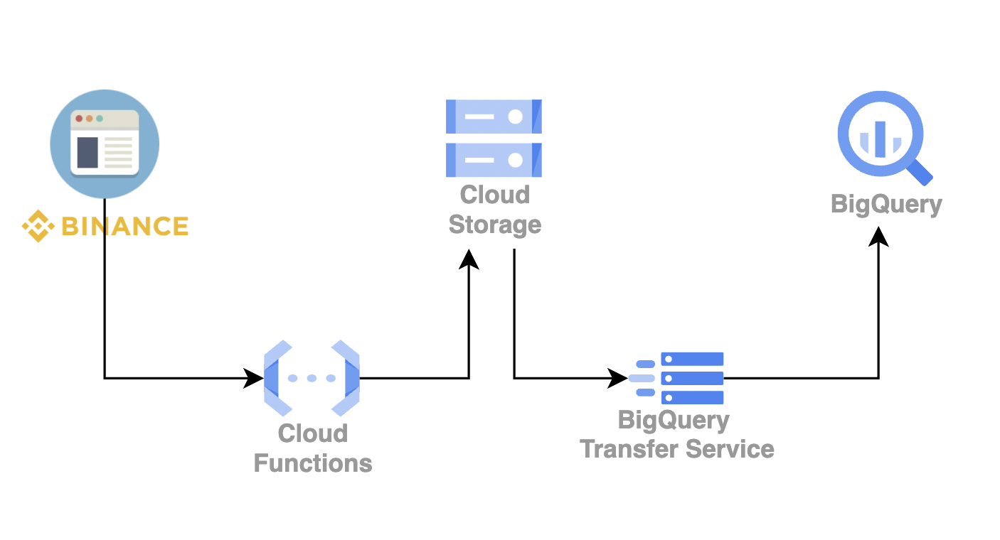

# Cargando tablas de Binance a Bigquery de forma incremental

## Diagrama de Arquitectura de la solucion a implementar.



## Abrir Cloud Shell Editor

1. Para empezar primero abrir la terminal de cloud shell.

2. Clonar el repositorio en el directorio home.

```bash
cd &&rm -rf data_engineering_en_gcp && git clone https://github.com/HolaGCP/data_engineering_en_gcp.git
```

3. Abrir Cloud Shell Editor.

```bash
cloudshell ws $HOME/data_engineering_en_gcp
```

## Laboratorio

1. Siempre antes de empezar establecer el proyecto en el que se ejecutaran los comandos. Ejemplo:

```bash
gcloud config set project nth-victory-357100
```

2. Despliega la función con el siguiente comando:

```bash
cd $HOME/data_engineering_en_gcp/4_bigquery_llevando_datos/laboratorio_1/cloud_functions/daily
gcloud functions deploy python-http-function \
--gen2 \
--timeout=3600 \
--runtime=python38 \
--region=us-east1 \
--source=. \
--entry-point=my_http_function \
--trigger-http \
--allow-unauthenticated
```

3. Ejecuta la función:

```bash
curl \
  --request GET \
  --header "Authorization: Bearer $(gcloud auth print-access-token)" \
  $(gcloud functions describe python-http-function \
    --region=us-east1 --gen2\
    --format="value(serviceConfig.uri)")
```

4. Abre otra terminal y crea la tabla destino

```bash
bq mk --dataset --location us-east1 binance
bq rm -f -t binance.BTCUSDT
bq mk --table --time_partitioning_field open_time \
    --time_partitioning_type DAY \
    binance.BTCUSDT 4_bigquery_llevando_datos/laboratorio_1/schema.json
```

5. Ejecuta el transfer:

```bash
project=$(gcloud config get project)
bq mk --transfer_config \
--project_id=$project \
--target_dataset=binance \
--display_name='Binance' \
--params='{"data_path_template":"gs://$project/binance-data/daily/BTCUSDT-1m-*.csv",
"destination_table_name_template":"BTCUSDT",
"file_format":"CSV",
"ignore_unknown_values":"true",
"field_delimiter":",",
"allow_quoted_newlines":"true",
"allow_jagged_rows":"false"}' \
--data_source=google_cloud_storage \
--schedule='every 15 minutes'
```