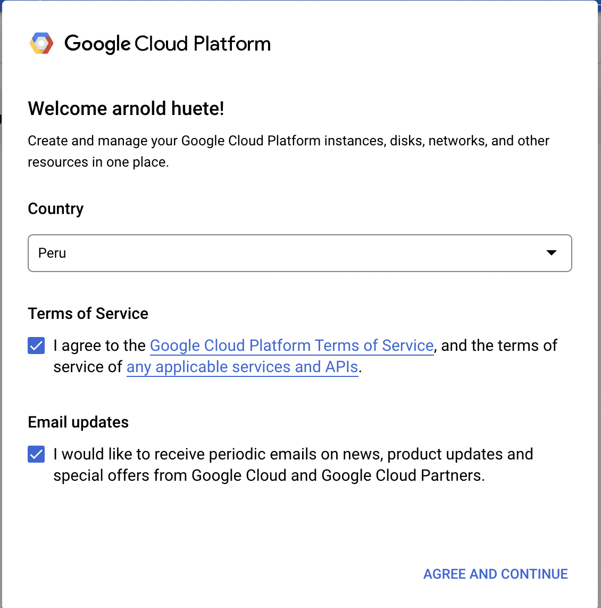
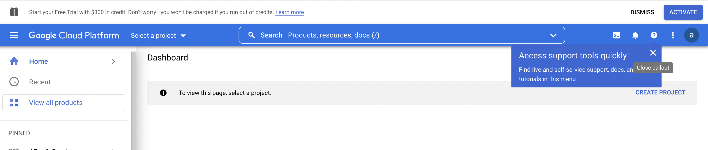
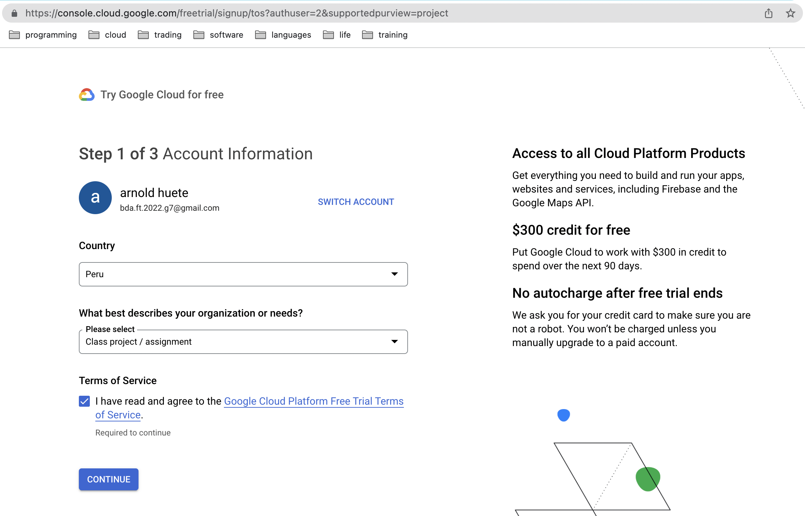
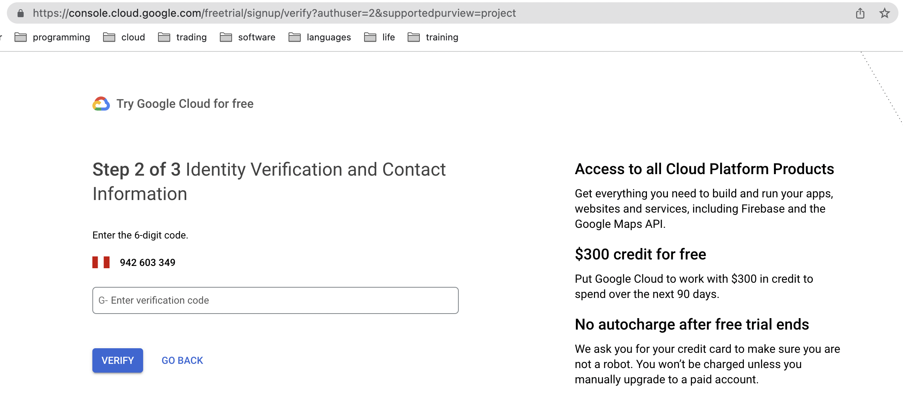
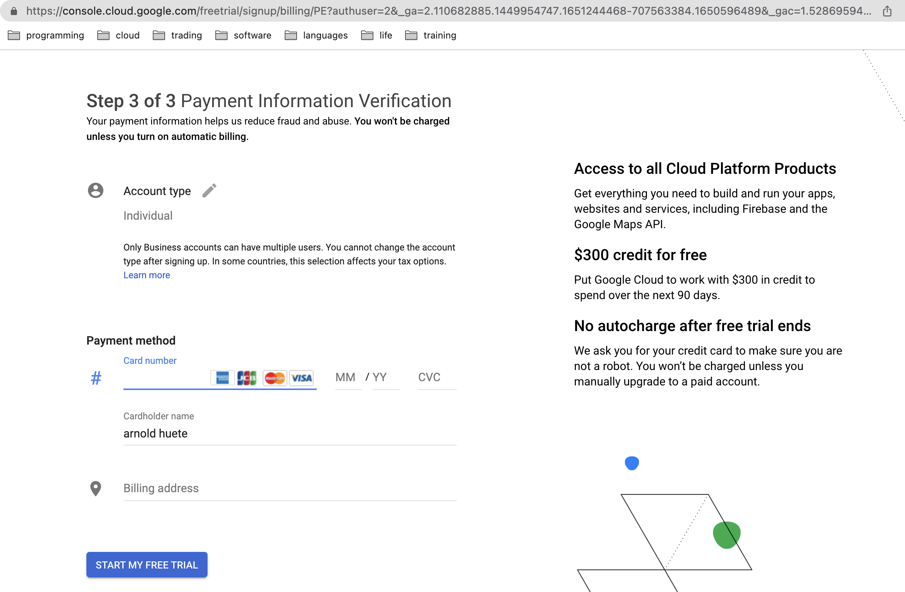

# Paso a paso para acceder al periodo de prueba gratuita de GCP.

1. Acceder al siguiente [link](https://cloud.google.com/docs/get-started)

2. Cuando entres a la consola te va a pedir aceptar terminos del servicio. Hacer click en aceptar y continuar.

3. Hacer click en el boton azul de arriba de Activar(Activate)

4. Como primer paso te piden llenar el pais, descripcion de uso y aceptar los terminos de la prueba gratuita. Luego hacer click en continuar.

5. Segundo paso: Llenar información de contacto.

6. Tercer paso: Llenar un metodo de pago. La informacion de la tarjeta de credito es solo para comprobar tu identidad y que no eres un robot. No habra ningun cargo.

