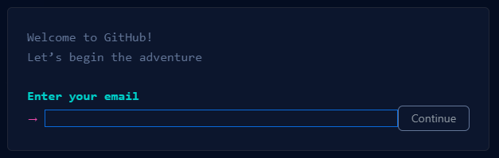
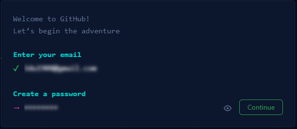
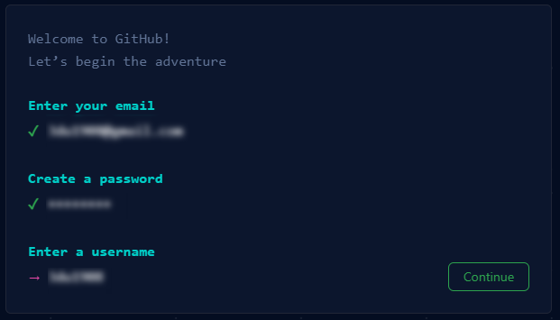
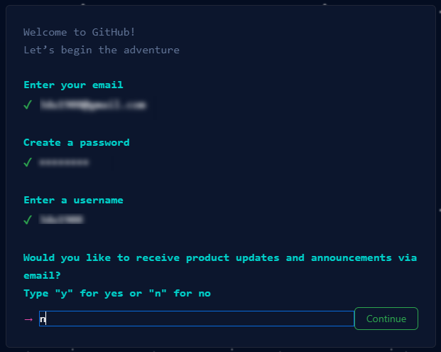
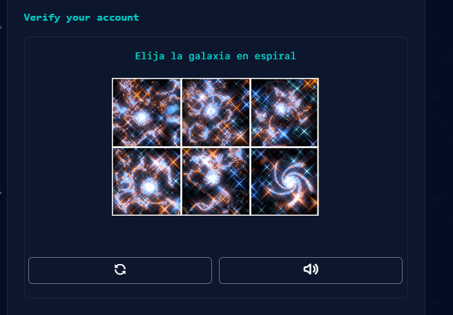
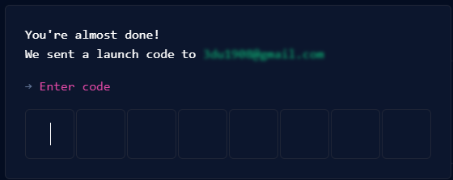
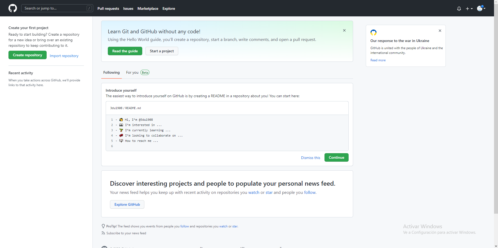

# Paso a paso para crear cuenta github.

1. Acceder al siguiente link [link](https://github.com)

2. Ingresa tu email.

3. Elige un password.

4. Ingresa un "username"

5. Te consultarán si deseas recibir noticias de github via email, elige "y" para aceptar y "n" para denegar.

6. Te entregarán un "puzzle" para verificar si eres humano.

7. Ingresamos un código que recibiremos en el email ingresado.

8. Nos hacen ciertas preguntas para personalizar, sin embargo se pueden saltear.

9. Nuestra cuenta esta lista para ser utilizada.

