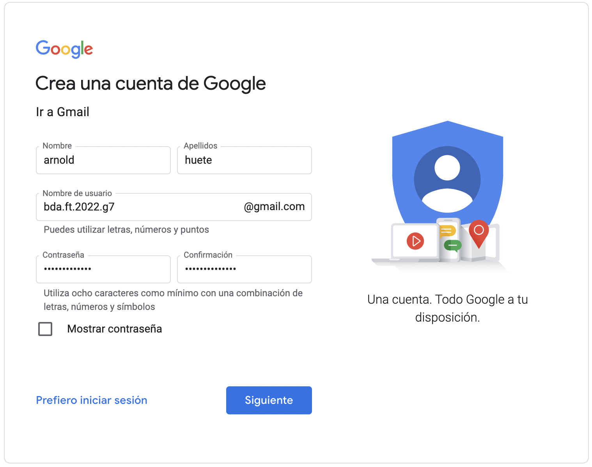
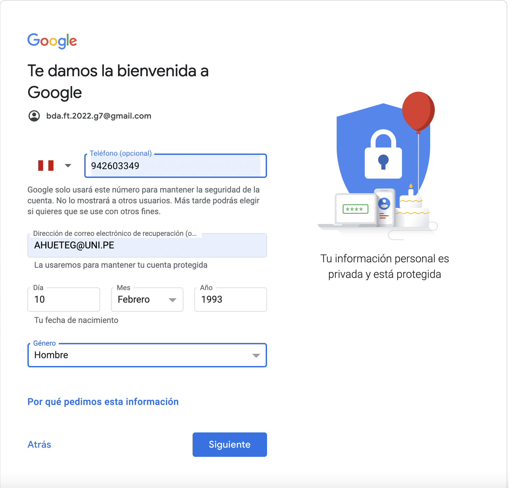

# Paso a paso para crear cuenta gmail.

1. Acceder al siguiente [link](https://accounts.google.com/signup/v2/webcreateaccount?service=mail&hl=es&continue=http%3A%2F%2Fmail.google.com%2Fmail%2F%3Fpc%3Dtopnav-about-es&flowName=GlifWebSignIn&flowEntry=SignUp).

2. Llenar los datos de nombre, apellidos, usuario y contraseña como muestra en la imagen abajo. Luego hacer click en siguiente.

3. En la siguiente pagina te pedire el telefono, correo de recuperación, fecha de nacimiento y genero. Luego hacer click en siguiente.

4. Aquí te pedira un código que sera enviado a tu telefono. Despues de llenarlo ya podras a acceder a la cuenta de gmail.